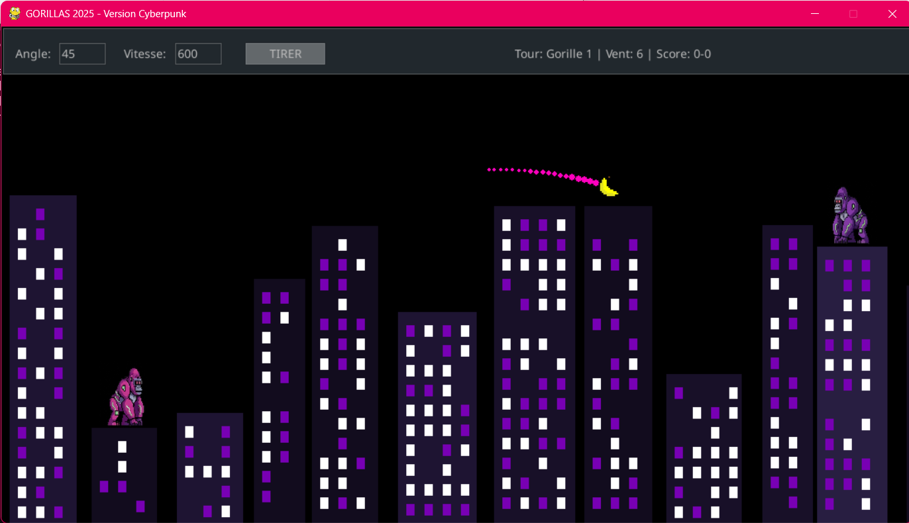

# Retro Cyberpunk Gorilla

Un jeu d'artillerie en 2D développé en Python avec Pygame, reprenant les mécaniques classiques du jeu de gorille rétro dans un univers visuel cyberpunk.

## Présentation du projet
Deux joueurs s'affrontent au sommet d'une ville générée de manière procédurale. L'objectif est de détruire le gorille adverse en calculant la trajectoire de tir d'une banane. Le projet intègre une simulation physique complète et une interface utilisateur adaptative.

## Caractéristiques techniques
* Génération procédurale d'immeubles avec éclairages de fenêtres aléatoires.
* Physique de tir parabolique prenant en compte la gravité terrestre et la vitesse d'un vent variable à chaque tour.
* Système de traînée de particules dynamiques pour matérialiser la trajectoire du projectile.
* Sauvegarde persistante de l'historique des matchs au format JSON.
* Interface de saisie de l'angle et de la vitesse de lancer gérée par pygame_gui.

## Technologies
* Python 3
* Pygame (Gestion du moteur de jeu et des graphismes)
* Pygame GUI (Interface utilisateur pour les paramètres de tir)
* JSON (Structure de sauvegarde des scores locaux)
